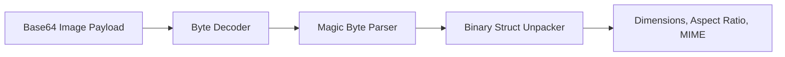

# genpark-base64-image-mime-dimension-analyzer-skill

A pure Python zero-dependency binary parser extracting width, height, aspect ratio, and MIME format directly from image headers (PNG, JPEG, GIF, WebP).

## Architecture

## Features
- **Zero Dependencies**: Pure standard library `struct` and `base64`.
- **High Speed**: Reads only first 24-64 bytes without loading entire image.
- **MCP Support**: Native JSON-RPC 2.0 interface.
